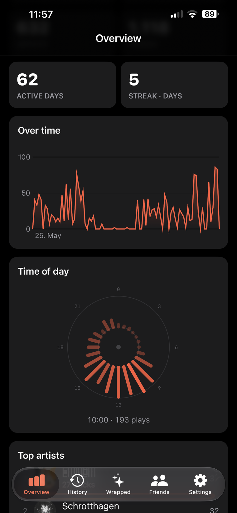
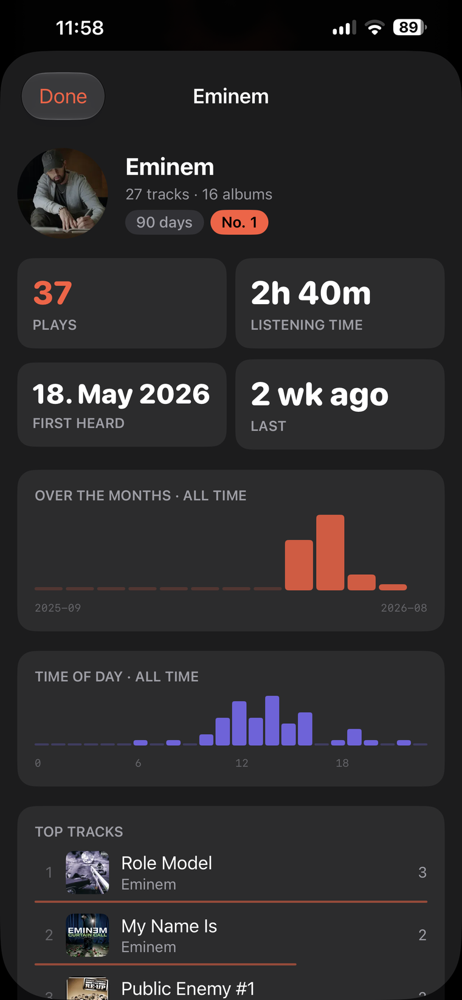
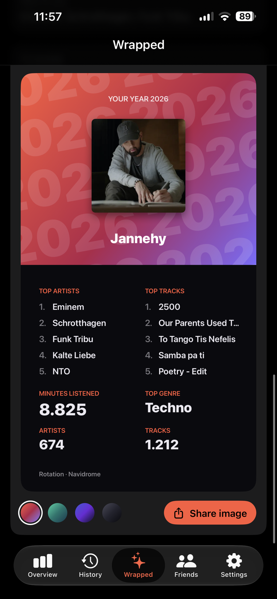
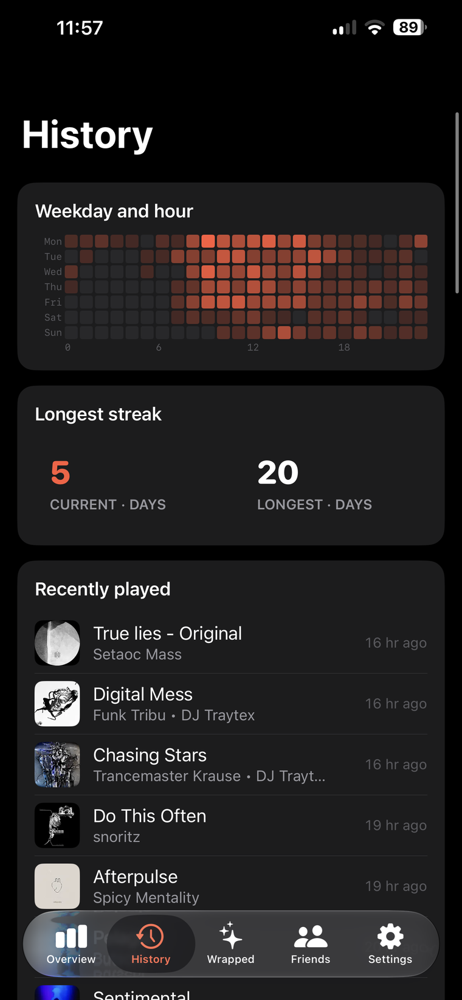

# Rotation for iOS

A native SwiftUI client for a [Rotation](https://github.com/Jannehy/rotation)
server — your listening year, from your pocket.

<p align="center">
  
  
  
  
</p>

## What it does

| Screen | What you get |
|---|---|
| **Overview** | Top artists, tracks, albums and genres for 7, 30 or 90 days, this year or all time — with rank, plays and hours, and your discoveries of the period |
| **Detail** | Every artist, album and track with its own history and a 30-second preview from your library |
| **History** | A weekday-by-hour heatmap and what you played last |
| **Recap** | Your year as a full-screen story: it advances by itself, holds when you hold it, plays music from your library, and asks you to guess before it tells |
| **Friends** | Other users of the same Navidrome and the artists you have in common |
| **Settings** | Server and account, who may find you, the accent colour, and the recap's season options including the December reminder |

English and German, following the device language. Six accent colours — and the
home screen icon follows the one you pick, without a second setting for it.

## What you need

- An **iPhone or iPad with iOS 16** or newer
- A **Rotation server** you can reach from the device — on your home network or
  through a VPN such as Tailscale or WireGuard
- A **Navidrome account** on the server behind it. Rotation has no user
  database of its own.

No server to hand? Tap **Try the demo** on the sign-in screen: an invented
listening year, complete with recap, entirely on the device.

## Installing

From the App Store, once the app is through review. Until then, and for
anything you build yourself:

```bash
brew install xcodegen
xcodegen generate
open Rotation.xcodeproj
```

Requires **macOS with Xcode 15** or newer. Pick your team under *Signing &
Capabilities* (or put your Team ID into `project.yml` so it survives
regeneration), then build to your device.

`Tools/build-ipa.sh` archives and exports an IPA from the command line.

## Connecting

On first launch, enter the address of your server:

| Typed | Used |
|---|---|
| `192.168.1.20` | `http://192.168.1.20:8770` |
| `192.168.1.20:9000` | that port instead of the default |
| `rotation.tail1234.ts.net` | over Tailscale, with the tunnel up |
| `https://rotation.example.com` | taken as typed, port 443 |

A bare host gets `http://` and Rotation's default port `8770`; anything more
explicit is used as you typed it, path prefix included. Behind an HTTPS reverse
proxy, enter the full `https://` URL.

Sign in with your Navidrome account. The session survives restarts.

## The icon

`Tools/make-icon.py` draws the record — one icon per accent colour — with the
standard library alone, no image dependency:

```bash
python3 Tools/make-icon.py
```

It writes `icon-1024.png` into each `AppIcon*.appiconset`, so the app on the home
screen wears the colour the app wears inside.

## Notes

- **The recap button** on the overview appears between 1 December and 31
  January, the way a yearly recap should. The Recap tab itself is there all
  year; its setting decides whether the button on that page shows outside the
  season.
- **The reminder** on 1 December is a local notification. No push server is
  involved — a self-hosted statistics app has no business running one.
- **Previews** are 30 seconds from a third of the way into the track, streamed
  untranscoded from Navidrome through your Rotation server.

## Licence

[MIT](LICENSE)
